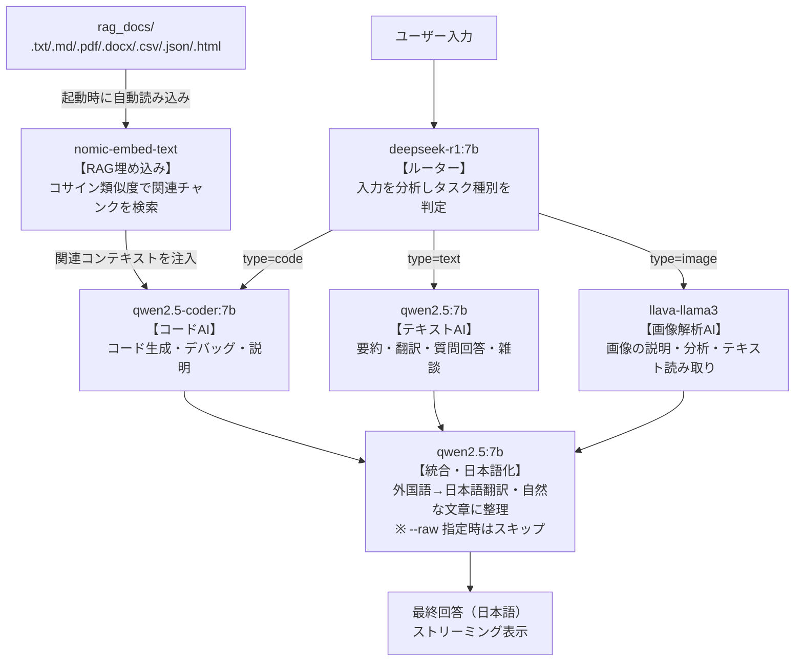

# Multi-Agent Orchestrator with Ollama

ローカルで動作するマルチエージェントAIシステム。
`deepseek-r1:7b` がルーターとしてタスクを振り分け、`qwen2.5:7b` が統合・日本語化を担当します。

---

## システム構成図



### 役割まとめ

| モデル | 役割 | 担当処理 |
|--------|------|----------|
| deepseek-r1:7b | ルーター | タスク分類（code / text / image） |
| qwen2.5:7b | テキストワーカー＋統合 | 質問回答・翻訳・要約、最終出力の日本語整理 |
| qwen2.5-coder:7b | コードワーカー | コード生成・デバッグ・説明 |
| llava-llama3 | 画像ワーカー | 画像説明・分析・テキスト読み取り |
| nomic-embed-text | 埋め込み | RAG用テキストベクトル化 |

---

## 動作確認済み環境

| 項目 | 内容 |
|------|------|
| OS | Windows 11 |
| CPU | Intel Core i7-9700K (8コア) |
| RAM | 48 GB |
| GPU | NVIDIA GeForce RTX 2060 SUPER (VRAM 8GB) |
| Python | 3.12.8 |

---

## 1. 事前準備

### Ollama のインストール

[https://ollama.com](https://ollama.com) からインストーラーをダウンロードして実行。

インストール確認:

```bash
ollama --version
```

### Python パッケージのインストール

```bash
pip install ollama pymupdf python-docx beautifulsoup4
```

| パッケージ | 用途 |
|-----------|------|
| `ollama` | Ollamaクライアント（必須） |
| `pymupdf` | PDF読み込み |
| `python-docx` | Word (.docx) 読み込み |
| `beautifulsoup4` | HTML読み込み |

> `.txt` / `.md` / `.csv` / `.json` のみ使う場合は `ollama` だけで動作します。

---

## 2. モデルのインストール

以下のコマンドを順番に実行してください。合計約20GBのストレージが必要です。

```bash
# ルーターAI（タスク分類）
ollama pull deepseek-r1:7b

# 日本語テキスト汎用＋統合担当
ollama pull qwen2.5:7b

# コーディング特化
ollama pull qwen2.5-coder:7b

# 画像理解（Vision）
ollama pull llava-llama3

# テキスト埋め込み（RAG用）
ollama pull nomic-embed-text
```

インストール済みモデルの確認:

```bash
ollama list
```

期待される出力:

```
NAME                       SIZE
deepseek-r1:7b             4.7 GB
qwen2.5:7b                 4.7 GB
qwen2.5-coder:7b           4.7 GB
llava-llama3:latest        5.5 GB
nomic-embed-text:latest    274 MB
```

---

## 3. 使い方

### 対話モードで起動

```bash
python -X utf8 orchestrator.py
```

起動後、日本語でそのまま話しかけてください。ルーターAIが自動でタスクを判断し、最適なモデルに振り分けます。

```
=== Multi-Agent Orchestrator ===
終了          : 'exit' または 'quit'
画像付き      : 'image: /path/to/image.jpg' を入力に含める
統合なし      : '--raw' を末尾に追加
RAG無効       : '--norag' を末尾に追加
履歴クリア    : '/clear'
ドキュメント再読込: '/reload'

あなた: （ここに入力）
```

### 終了

```
あなた: exit
```

---

## 4. 入力パターン

### テキスト・質問（qwen2.5:7b が担当）

```
あなた: 量子コンピュータをわかりやすく説明してください
あなた: この文章を英語に翻訳してください：「本日は晴天なり」
あなた: 江戸時代の文化について教えて
```

### コーディング（qwen2.5-coder:7b が担当）

```
あなた: Pythonでクイックソートを実装してください
あなた: このコードのバグを直してください：print("Hello"
あなた: JavaScriptで非同期処理を書く方法を教えて
```

### 画像解析（llava-llama3 が担当）

画像ファイルのパスを `image:` の後に指定します。

```
あなた: この画像に何が写っていますか？ image: C:/Users/yuto/Desktop/photo.jpg
あなた: 画像のテキストを読み取ってください image: C:/screenshot.png
あなた: image: C:/chart.jpg グラフの内容を説明して
```

### オプション一覧

| オプション | 効果 |
|-----------|------|
| `--raw` | 統合・日本語化をスキップしてワーカーの生出力をそのまま表示（高速化） |
| `--norag` | RAGによるドキュメント参照を一時的に無効化 |
| `/clear` | 会話履歴をリセット |
| `/reload` | `rag_docs/` を再スキャンして埋め込みを再生成 |
| `/save <名前>` | 現在の会話履歴を `sessions/<名前>.json` に保存（名前省略時はタイムスタンプ） |
| `/load <名前>` | 保存済みセッションを復元して会話を引き継ぐ |
| `/sessions` | 保存済みセッションの一覧を表示 |

```
あなた: Pythonでリストを逆順にする方法 --raw
あなた: 今日の天気は？ --norag
あなた: /save myproject
あなた: /load myproject
あなた: /sessions
```

---

## 5. RAG（ドキュメント参照）

`rag_docs/` フォルダにファイルを置くと、起動時に自動で読み込まれます。
質問内容に関連するチャンクが自動的に検索され、回答精度が向上します。

### 対応ファイル形式

| 形式 | 用途例 |
|------|--------|
| `.txt` | メモ、ログ、テキストデータ |
| `.md` | ドキュメント、README |
| `.pdf` | 論文、マニュアル、仕様書 |
| `.docx` | Word文書、議事録 |
| `.csv` | 売上データ、一覧表 |
| `.json` | 設定ファイル、APIレスポンス |
| `.html` | Webページ保存ファイル |

### セットアップ

```
rag_docs/
  manual.pdf        ← 製品マニュアル
  meeting.docx      ← 議事録
  sales.csv         ← 売上データ
  notes.txt         ← メモ
```

起動するだけで自動ロードされます。追加・変更後は `/reload` で再読み込みできます。

---

## 6. 処理の流れ（詳細）

1つの入力に対して内部では以下のステップが実行されます。

```
ステップ1: RAG検索（rag_docs/ にファイルがある場合）
  nomic-embed-text が質問をベクトル化し、
  関連チャンクをコサイン類似度で上位3件取得

ステップ2: ルーティング
  deepseek-r1:7b が入力を分析し、
  "text" / "code" / "image" のどれかに分類

ステップ3: ワーカー実行（ストリーミング）
  分類に対応する専門モデルが実際の処理を実行
  ※ 会話履歴・RAGコンテキストをメッセージに含める
  ※ 回答はリアルタイムで表示される

ステップ4: 統合・日本語化（--raw なしの場合、ストリーミング）
  qwen2.5:7b がワーカーの回答を
  自然な日本語に整理してユーザーに返す
  ※ ワーカー出力が長すぎる場合は1500文字でトランケート後に統合

ステップ5: 応答時間サマリー
  各ステップにかかった秒数と合計時間を表示
  例: [時間] RAG:0.8s  ルーター:2.1s  ワーカー:8.4s  統合:3.2s  合計:14.5s
```

---

## 7. Pythonコードから使う

`orchestrator.py` をモジュールとしてインポートして使えます。

戻り値は `(最終回答文字列, 更新された会話履歴)` のタプルです。

```python
from orchestrator import run

# テキストタスク
result, history = run("AIとは何ですか？")

# 会話履歴を引き継いで次の質問
result2, history = run("もう少し詳しく教えて", history=history)

# コードタスク
result, history = run("Pythonで素数判定関数を書いてください")

# 画像タスク
result, history = run("画像の内容を説明して", image_path="C:/photo.jpg")

# 統合なし（ワーカーの生出力）
result, history = run("バブルソートを実装して", integrate=False)

# RAG無効
result, history = run("今日の気分は？", use_rag=False)

print(result)
```

### RAGドキュメントの手動ロード

```python
from orchestrator import load_rag_docs
from pathlib import Path

count = load_rag_docs(Path("my_docs"))
print(f"{count} チャンク読み込み完了")
```

---

## 8. VRAM・RAM の目安

| モデル | VRAM使用量 | 動作モード |
|--------|-----------|-----------|
| deepseek-r1:7b | 約5GB | GPU |
| qwen2.5:7b | 約5GB | GPU |
| qwen2.5-coder:7b | 約5GB | GPU |
| llava-llama3 | 約6GB | GPU |
| nomic-embed-text | 約0.3GB | GPU |

※ 同時に複数モデルをロードすると VRAM を超えた分は自動的に RAM にオフロードされます。
※ RAM 48GB あるため大きなモデルの CPU 推論も可能です。

---

## 9. トラブルシューティング

### Ollama が起動していない

```
Error: dial tcp: connection refused
```

Ollama のデスクトップアプリを起動してから再実行してください。またはコマンドで起動:

```bash
ollama serve
```

### 文字化けが発生する

```bash
# -X utf8 オプションを必ず付けて実行
python -X utf8 orchestrator.py
```

### モデルが見つからない

```
Error: model not found
```

`ollama list` でインストール済みモデルを確認し、不足しているモデルを `ollama pull` で追加してください。

### GPU を使っていない（推論が遅い）

NVIDIA ドライバーと CUDA が正しくインストールされているか確認:

```bash
nvidia-smi
```

### PDFやDOCXが読み込まれない

```
[警告] pymupdf 未インストールのため xxx.pdf をスキップ
```

対応ライブラリをインストールしてください:

```bash
pip install pymupdf python-docx beautifulsoup4
```

---

## 10. ファイル構成

```
.
├── orchestrator.py       # メインシステム（ルーター＋ワーカー＋統合）
├── test_orchestrator.py  # 動作テスト用スクリプト
├── rag_docs/             # RAG参照ドキュメント置き場（起動時に自動ロード）
├── sessions/             # 保存済み会話履歴（/save で自動生成）
└── README.md             # このファイル
```

---

## 11. モデルの追加・変更

`orchestrator.py` の先頭部分を編集することでモデルを変更できます。

```python
LEADER_MODEL = "deepseek-r1:7b"   # ルーターを変更したい場合ここを編集

WORKERS = {
    "text":  "qwen2.5:7b",         # テキスト担当・統合担当を変更したい場合
    "code":  "qwen2.5-coder:7b",   # コード担当を変更したい場合
    "image": "llava-llama3",        # 画像担当を変更したい場合
}
```

Ollama で利用可能なモデル一覧: [https://ollama.com/library](https://ollama.com/library)
